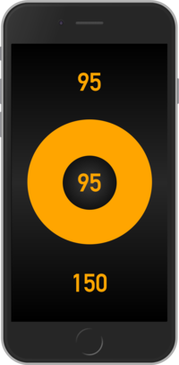
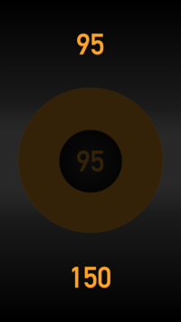
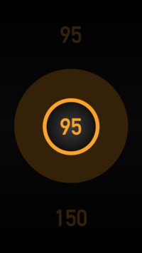

    

<h1 align="center">
  Axl Metronome
</h1>

      

Axl Metronome is a simple metronome for musicians who want to concentrate on practice. It increases or decreases tempo automatically and frees to be disturbed to change tempo.

# User's section

## What you can do

* Set beginning and ending tempo.
* Start, pause and resume metronome.
* Change remaining time.

## What you cannot do
Since this app has designed to be simple some of the features are not provided.

* Change time to count; it is arbitrary set to 30 minutes. 
* Stop metronome; you can only pause.

## How to use
This app consists of three parts and each of them has user interaction.

### Tempo Selector

Tempo Selector consists of two splitted parts that one is for beginning tempo and another one is for ending tempo. `Swipe left` (in portrait mode) or `swipe down` (in landscape mode) to decrease value and `swipe right` (in portrait mode) or `swipe up` (in landscape mode) to increase value.

### Ring

Ring indicates a progress that how long time has passed and allows to change it. `Tap` or `drag` to change progress.

### Button

Button indicates current tempo and allows to start, pause and resume metronome. `Tap` to start and later it toggles pause and resume each time you `tap`.

## How the idea has come?
I don't like pause-practice-to-change-tempo ritual. Everybody does but I'm lazy guy 😛.

# Developer's section
Being a hobbyist programmer for a long time but unfamiliar with the latest web technology I made this app for my study. This section describes things that I used and my thought.

## Services

### Travis CI
> The simplest way to test and deploy your projects.

>> Easily sync your GitHub projects with Travis CI and you'll be testing your code in minutes.

After using this I can't imagine development without CI/CD. CI/CD ensures that things before deployment have certainly done automatically and saves developer's time.

### Sourcegraph + browser extension
> Search, navigate, and review code. Find answers.

>> Sourcegraph is a web-based code search and navigation tool for dev teams.

I every time take care of coverage. When I see my code on GitHub, browser extension shows code highlighted and make me aware of coverage.

### Greenkeeper
> AUTOMATED DEPENDENCY MANAGEMENT

>> Get safety & consistency with real-time monitoring and automatic updates for npm dependencies

I think it's not a good idea to update package immediately because it may destruct app. It only must be done if vulnerability has found and it's what Snyk does. The reason that I even use Greenkeeper is for performance improvement; package update may improve performance. When Greenkeeper detects package update I test whether it improves performance and if it does I apply update even if there is no vulnerability.

### Codecov
> Develop healthier code.

>> Improve your code review workflow and quality. Codecov provides highly integrated tools to group, merge, archive, and compare coverage reports.

I believe that test coverage is important. Codecov helped me not to forget testing features by reporting coverage when I committed or when I merged PR.

### Netlify
> Build, deploy, and manage modern web projects

>> An all-in-one workflow that combines global deployment, continuous integration, and automatic HTTPS. And that’s just the beginning.

Super handy service to deploy PWA quickly with less configuration. Being still beta though I like Split Testing which is effective to compare services. I'm currently running Split Testing to see which one of [LogRocket](https://logrocket.com/) and [FullStory](https://www.fullstory.com/) is suitable for me.

### Slack
> Slack is a collaboration hub for work, no matter what work you do.

I integrated all of the service I use. Slack notifies service's update in real time and I can see its status easily. My favorite integration is with Bugsnag and Snyk, they let me know what happened unexpectedly.

### Zube
> Zube is an Agile project management platform that allows everyone on your team to communicate with the developers.

Fantastic platform to manage my tasks, ideas and issues. It has powerful integration with GitHub that syncs issues bi-directionally, i.e. issues can be created on Zube and they show up on GitHub and vice versa, so that there is no need to switch Zube and GitHub to manage issues. Any service that makes issues on GitHub works like integrated with Zube. In my case Bugsnag does; when errors have found Bugsnag opens issues on GitHub and I can see them on Zube.

### ConfigCat
> DEPLOY ON FRIDAYS TOO...

>> Manage your features and configurations without actually deploying new code.

Before I couldn't imagine how effective feature flags are. I thought that what feature flags do can be done by re-compiling as well but actually they are not same. Using ConfigCat I got how feature flags work effectively in development.

### Bugsnag
> Balance agility with stability.

>> Bugsnag monitors application stability, so you can make data-driven decisions on whether you should be building new features, or fixing bugs.

Bugsnag catches bugs which appear in various environment and situation that I don't expect. It boosts me to solve problems and to improve app's quality.

### Snyk
> Use Open Source. Stay Secure.

>> A developer-first solution that automates finding & fixing vulnerabilities in your dependencies

Keeping app secure is important but how to do it? Do I need to scan project periodically? Snyk takes it over. Integrating with GitHub it periodically checks if the used packages are threatened and in case of that it notifies me. If available it also opens a PR which solves vulnerability by package update.

### CodeFactor
> Let's make software better.

>> Automated Code Review for Git.

One of the purpose of code review is to keep code readable. CodeFactor helped me by measuring quality of code and advising how to make it better. I like its fix suggestion; fix can be performed easily by a click that creates PR which fixes code automatically.

### Cypress
> The web has evolved. 
> Finally, testing has too.

>> Fast, easy and reliable testing for anything that runs in a browser.

Ideal e2e testing tool for Chrome which involves lodash, jQuery, Sinon etc. Using two testing tools I learned how they differ; Cypress is for black-box testing and Jest is for white-box testing. I love Cypress' movie recording feature that helps me observing behavior during testing and reproducing error when occurred.

## Packages

### Storybook
> Build bulletproof UI components faster

>> Storybook is an open source tool for developing UI components in isolation for React, Vue, and Angular. It makes building stunning UIs organized and effective.

Storybook is definitely one of my favorite tool. Being able to see each component individually changes development faster and safer. For addons I like `addon-knobs` and `addon-jest`. The prior one makes easier to find the best props values and the latter one ensures that the component has tested.

My stories can be seen here: https://storybook--axl-metronome.netlify.com/

### Gatsby
> Fast in every way that matters

>> Gatsby is a free and open source framework based on React that helps developers build blazing fast websites and apps

After making app in traditional way I turned it into PWA using Gatsby. Gatsby is known as a static site generator but it also realizes to make PWA and thanks to its large community I could integrate Gatsby with TypeScript, Storybook and Jest.

### husky
> Git hooks made easy

It liberated me from keeping todos-before-commit in mind and allowed to concentrate on coding.

### Jest
> Jest is a delightful JavaScript Testing Framework with a focus on simplicity.

Testing is one of the key points I learned because I deeply understood how efficient and fundamental it is. I could  notice unexpected behavior caused by small update and fix before my app totally collapses. Writing test can be taken non-productive as it takes time and doesn't matter the product directly, but I would strongly say that test must be written for app's and also developer's health.

## Technologies

### TypeScript
When I started programming I learned JAVA so I like OOP. TypeScript realizes to write JAVA-like code with types, access level modifiers, enums, etc. that I wished for a long time. TypeScript allowed me to code comfortably.

### Linters (TSLint, ESLint, Stylelint)
Inconsistent code can appear even same person codes. Linters helped me to write consistent code and to retain readability.

### Git
With no doubt those who knows and didn't know Git is completely another person. Capability to trace its history allowed me to see how my project has proceeded and helped imaging how efficient it is for team use.

#### git merge / git merge --no-ff / git rebase -i -p
Keeping history clean and proper is important to retain traceability. I learned their differences and situations to use.

#### git reflog / git reset
They saved me a lot in case of mal- commit/merge/rebase.

### git-flow (AVH Edition)
Helpful plugin to base development on [a successful Git branching model](https://nvie.com/posts/a-successful-git-branching-model/). When installing this I newly learned bash completion and also installed git-flow-completion which turned typing blazing fast.

## My contributions
Here is a list of the issue I found, reported and contributed during development.

### Sourcegraph
* [Codecov "Coverage: %" not showing up for some public repo](https://github.com/sourcegraph/sourcegraph/issues/2073)

### ConfigCat
* [Fix: Some options of User are not optional](https://github.com/configcat/common-js/pull/1)
  * I am the first contributor 😎 !
* [CORS error on Safari](https://github.com/configcat/node-sdk/issues/5)

### Gatsby + Storybook integration
* [StaticQuery doesn't work with StorybookJS v4](https://github.com/gatsbyjs/gatsby/issues/12007)

## 💫 Deploy

# Future work
* Rewrite for native app because PWA does not support running in background.

# External link

* https://appsco.pe/app/axlmetronome